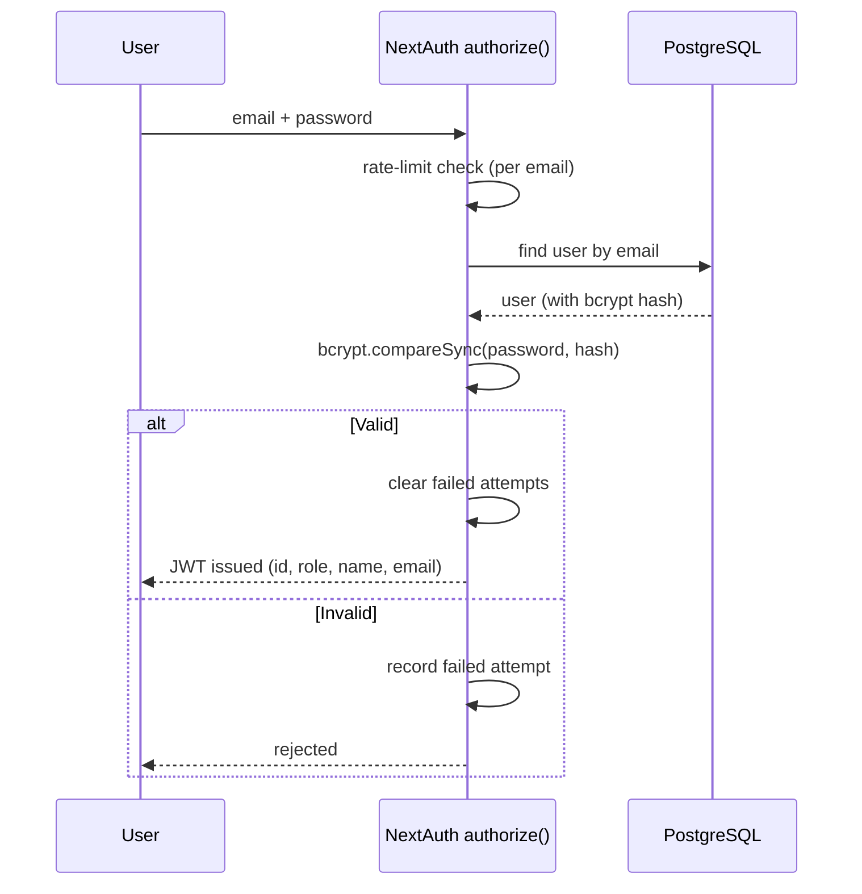

# Authentication & Access Control

Authentication is handled by **NextAuth.js v4** using a **Credentials provider**
and the **JWT** session strategy. The configuration lives in `src/lib/auth.ts`.

## Login

- **Password check.** Passwords are verified against a bcrypt hash
  (`bcrypt.compareSync`). Plaintext passwords are never stored.
- **Session.** On success a JWT is issued carrying the user's `id` and `role`.
  Sessions last **8 hours** (`maxAge: 8 * 60 * 60`) — "one school day."

## Rate limiting

`src/lib/auth.ts` maintains an **in-memory** limiter: at most **10 failed
attempts per email address per 15-minute window**. Exceeding it throws
"Too many failed login attempts. Please wait 15 minutes." A successful login
clears the counter for that email.

::: warning Single-instance limitation
The limiter is a plain in-memory `Map`. It resets on server restart and is **not
shared across multiple instances**. For a horizontally-scaled deployment this
should be moved to a shared store (e.g. Redis). Noted in
[Limitations](/thesis/limitations).
:::

## JWT re-validation

On every session refresh, the `jwt` callback re-reads the user's role from the
database:

- If the user no longer exists, the token is marked **invalidated** and the
  session is emptied — deleted users are logged out automatically.
- Otherwise the token's `role` is refreshed from the DB, so role changes take
  effect without requiring the user to log in again.

## Route protection (middleware)

`src/middleware.ts` wraps the app with `withAuth`:

**Public routes** (always allowed): `/`, `/forgot-password`, `/reset-password`,
`/api/auth`. Everything else requires a valid token.

**Role enforcement:**

| Path prefix | Allowed role | Otherwise |
|---|---|---|
| `/admin/**` | `ADMIN` | redirect to `/` |
| `/teacher/**` | `TEACHER` | redirect to `/` |
| `/student/**` | `STUDENT` | redirect to `/` |

Authenticated users hitting `/` are redirected to their dashboard
(`/admin/dashboard`, `/teacher/roster`, or `/student/dashboard`).

## Authorization in server actions

Middleware is the first line of defence, not the only one. **Every server
action** independently calls `getServerSession(authOptions)` and checks the role
before mutating. Examples:

- Admin actions call a `requireAdmin()` helper that throws unless the caller is
  an admin.
- `scanQrAttendance()` throws unless the caller is a teacher, then further checks
  that the teacher owns the scanned subject.
- `updateAttendance()` rejects students outright and enforces the time-lock for
  teachers.

This "defence in depth" means an attacker cannot bypass authorization by calling
an action directly. See [Server Actions](/developer/server-actions) for the
per-action requirements.

## Password reset

The password-reset support (`src/app/actions/password.ts`) uses a
`crypto.randomBytes(32)` token with a 30-minute, single-use expiry stored in the
`VerificationToken` table. Recent versions surface a "contact your
administrator" notice instead of self-service email reset, and admins can set a
temporary password directly from the Staff and Masterlist screens.
