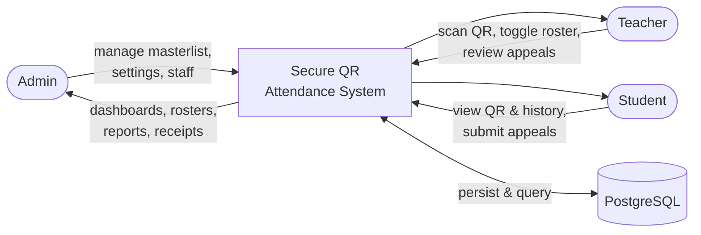
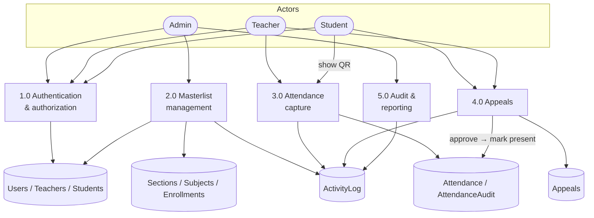
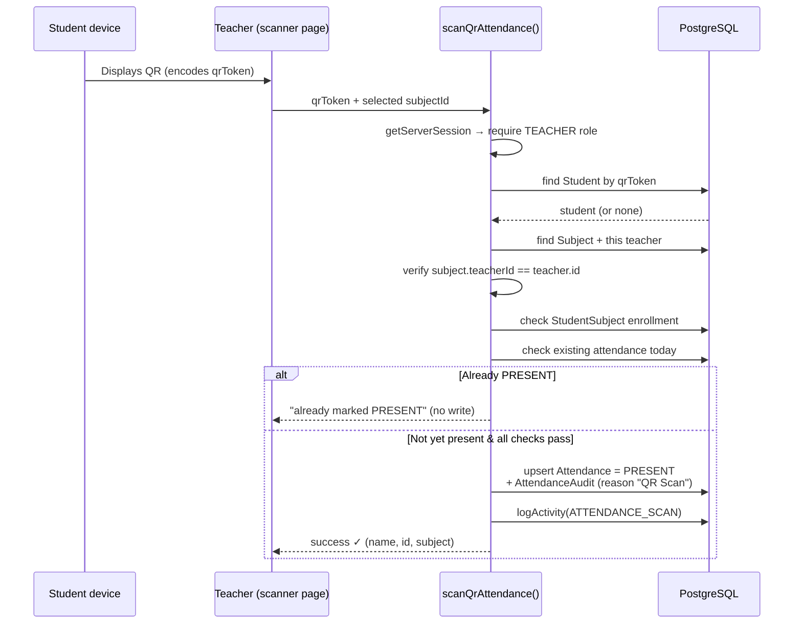

# Data Flow

This page shows how data moves through the system, in the style of a data-flow
diagram (DFD) suitable for the thesis.

## Context diagram (Level 0)

## Level 1 — main processes and stores

## QR scan sequence

The most important runtime flow — a teacher scanning a student's code:

Each validation step can short-circuit with a specific message (invalid code,
wrong teacher for the subject, not enrolled, already present). The full
narrative is on the [QR Attendance Flow](/features/qr-attendance) page.

## Notes on consistency

- **Transactions.** Attendance writes and their audit rows are committed together
  via `prisma.$transaction()`, so an attendance change never exists without its
  audit trail.
- **Idempotent scans.** A student already marked `PRESENT` for the day/subject is
  skipped, so repeated scans don't create duplicates or spurious audit rows.
- **Date keys.** The unique key `(studentId, date, subjectId)` uses a
  UTC-midnight `date`, guaranteeing one record per student per subject per day.
