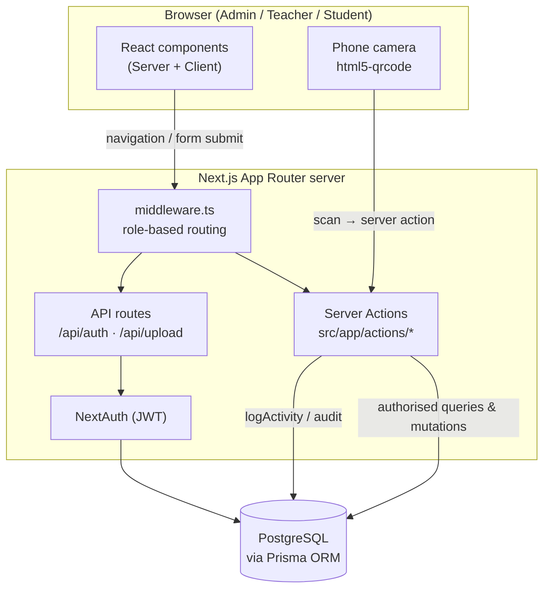

# Architecture Overview

The Secure QR Attendance System is a **monolithic, full-stack Next.js
application** (App Router). The frontend (React Server and Client Components) and
the backend (Server Actions, a couple of API routes, and Prisma) live in a single
codebase and deploy as one unit.

## High-level architecture

## Key architectural decisions

- **Server Actions over REST.** Almost all data operations are Next.js Server
  Actions in `src/app/actions/`, not REST controllers. Only two real API route
  handlers exist: NextAuth (`/api/auth/[...nextauth]`) and file upload
  (`/api/upload`). See [API Routes](/developer/api-routes).
- **Role-based routing at the edge.** `src/middleware.ts` gates every request:
  it redirects authenticated users from `/` to their dashboard and blocks
  cross-role access to `/admin`, `/teacher`, and `/student`.
- **Authorization in depth.** Even after middleware, every server action
  independently re-checks the session and role before touching the database.
- **JWT sessions.** NextAuth uses the JWT strategy (not database sessions for
  auth), with an 8-hour lifetime. The token is re-validated against the database
  on refresh to catch deleted or role-changed users.
- **Auditing is built in.** Mutations call `logActivity()`; attendance changes
  additionally write an immutable `AttendanceAudit` row inside the same
  transaction.
- **Timezone safety.** Attendance dates are normalised to UTC midnight so a
  "day" is consistent regardless of server timezone; display formatting uses
  `Asia/Manila`.

## Request lifecycle (typical mutation)

1. A user action (form submit, toggle, or scan) invokes a **Server Action**.
2. The action calls `getServerSession()` and verifies the caller's **role**.
3. Business rules are checked (e.g. subject ownership, enrollment, time-lock).
4. The write runs, often inside a **`prisma.$transaction()`** together with an
   audit record.
5. **`logActivity()`** records the mutation in `ActivityLog`.
6. **`revalidatePath()`** invalidates affected pages so fresh data is shown.
7. The action returns a `{ success, message }` result the UI can toast.

This pattern is described in detail under
[Conventions & Utilities](/developer/conventions).

## Related pages

- [Tech Stack](/architecture/tech-stack)
- [Project Structure](/architecture/structure)
- [Data Flow](/architecture/data-flow)
- [Auth & Access Control](/architecture/auth)
