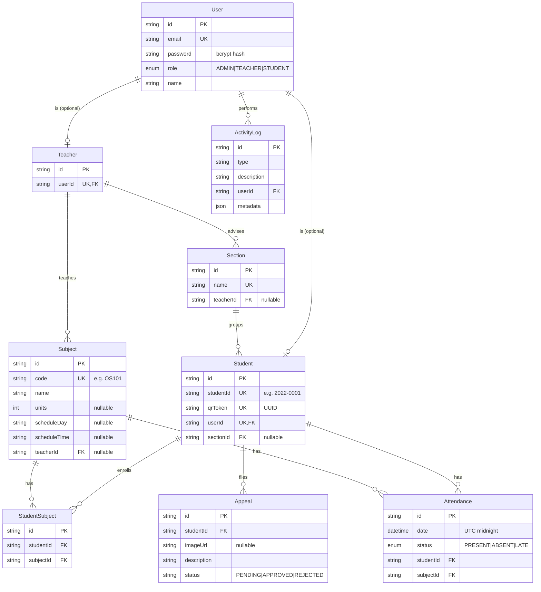

# Entity–Relationship Diagram

The database is PostgreSQL, modelled with Prisma (`prisma/schema.prisma`). The
diagram below shows the core domain entities and their relationships. NextAuth's
`Account`, `Session`, and `VerificationToken` tables are omitted for clarity and
described on the [Model Reference](/database/models) page.

## Key relationships in words

- A **User** is exactly one role. A user is optionally linked 1:1 to a
  **Teacher** or a **Student** profile.
- A **Teacher** advises many **Sections** and teaches many **Subjects** (both
  links are optional on the section/subject side).
- A **Section** groups many **Students**; a student belongs to at most one
  section (`sectionId` is nullable).
- **Students** and **Subjects** form a many-to-many relationship through
  **StudentSubject** (enrollment), which is unique per `(studentId, subjectId)`.
- **Attendance** ties a student and a subject to a date, unique per
  `(studentId, date, subjectId)` — one record per student per subject per day.
- **AttendanceAudit** (not drawn) is an append-only log referencing an attendance
  record by id.
- **Appeals** belong to a student and are reviewed by a teacher or admin.

Field-by-field detail, enums, and constraints are on the
[Model Reference](/database/models).
