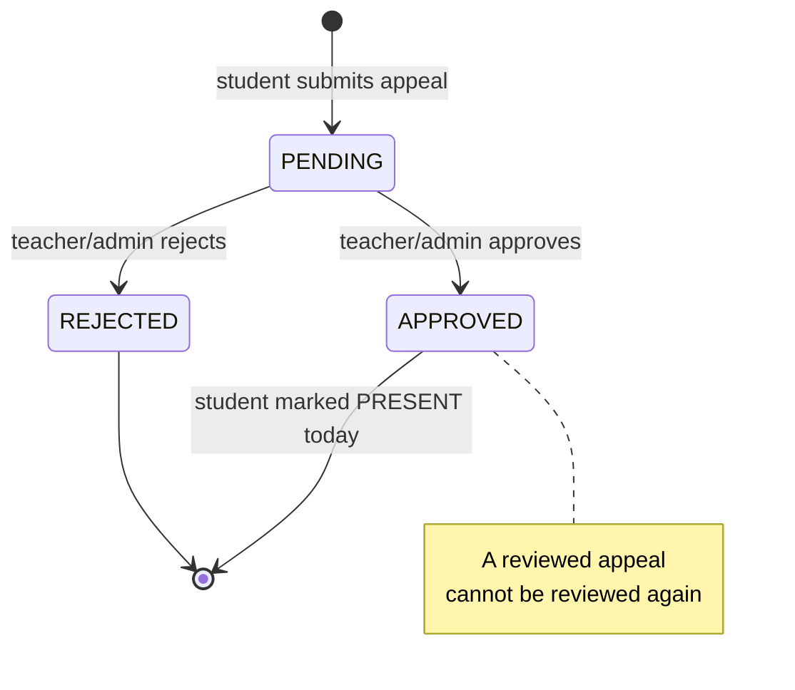

# Appeals Workflow

Appeals let students contest or correct their attendance. The logic is in
`src/app/actions/appeals.ts`, with the submission form in
`src/components/AppealForm.tsx`.

## Lifecycle

## Submitting (student)

From **`/student/appeals`**, the student writes a description of the reason and
submits. `submitAppeal(studentId, description)` creates an `Appeal` with status
`PENDING` and revalidates both the student's and the teacher's appeals pages.

::: info Proof images
The data model (`Appeal.imageUrl`) and the upload endpoint (`/api/upload`, which
validates type and a 5 MB limit) support attaching a proof image such as a
medical certificate. The current student appeal form submits the written
description; proof-image attachment is available through the upload endpoint and
the schema field.
:::

## Reviewing (teacher / admin)

From **`/teacher/appeals`**, a teacher sees appeals from students enrolled in the
subjects they teach (`getTeacherAppeals()` resolves this by looking up
enrollments in the teacher's subjects). Admins can also review appeals.

`reviewAppeal(appealId, status)`:

1. Requires a `TEACHER` or `ADMIN` session.
2. Loads the appeal; if it's no longer `PENDING`, returns
   *"This appeal has already been reviewed."*
3. Updates the appeal's `status`, `reviewedBy`, and `reviewedAt`.
4. **If approved**, marks the student **PRESENT for today** in the first subject
   they're enrolled in (upserting the attendance record).
5. Logs an `APPEAL_REVIEW` activity entry and revalidates the relevant pages.

## Outcome summary

| Decision | Effect |
|---|---|
| **Approved** | Appeal marked `APPROVED`; student set `PRESENT` for today. |
| **Rejected** | Appeal marked `REJECTED`; attendance unchanged. |

Once reviewed, the decision is final for that appeal — the student would submit a
new appeal to contest again.
