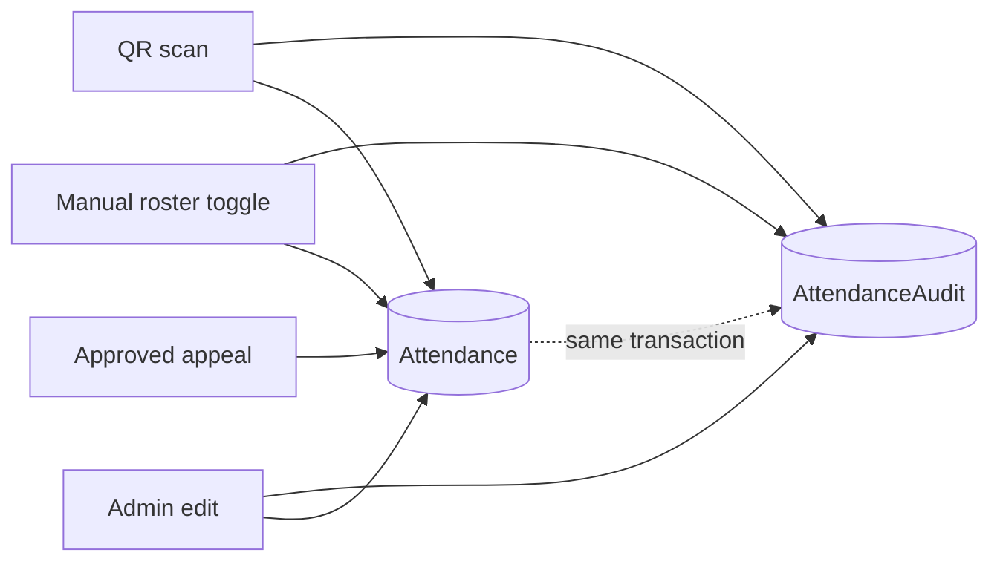

# Audit & Activity Logging

The system keeps two complementary records of what happens: a **system-wide
activity log** and an **attendance-specific audit trail**.

## Activity log (`ActivityLog`)

Every meaningful mutation calls `logActivity(type, description, metadata?)` from
`src/lib/audit.ts`. Each entry stores the activity `type`, a human-readable
`description`, the acting `userId`, optional JSON `metadata`, and a timestamp.
The admin **Audit** page and the dashboard's recent-activity feed read from this
table.

`logActivity()` resolves the current session internally, and it is intentionally
**fail-safe** — if writing the log fails, the error is swallowed so the main
operation still succeeds.

### Activity types

The `ActivityType` union (`src/lib/audit.ts`) enumerates every logged event:

| Category | Types |
|---|---|
| **Attendance** | `ATTENDANCE_EDIT`, `ATTENDANCE_SCAN`, `ATTENDANCE_ADMIN_EDIT`, `ATTENDANCE_DELETE` |
| **Staff** | `STAFF_ADD`, `STAFF_REMOVE` |
| **Students** | `STUDENT_ADD`, `STUDENT_REMOVE`, `STUDENT_UPDATE`, `STUDENT_PASSWORD_RESET`, `STUDENT_QR_REGEN` |
| **Sections** | `SECTION_ADD`, `SECTION_REMOVE`, `SECTION_UPDATE` |
| **Subjects** | `SUBJECT_ADD`, `SUBJECT_REMOVE`, `SUBJECT_UPDATE` |
| **System** | `SETTING_UPDATE`, `APPEAL_REVIEW`, `MASTERLIST_IMPORT`, `DATA_RESET` |

## Attendance audit trail (`AttendanceAudit`)

Every create or update of an attendance record also writes an **immutable**
`AttendanceAudit` row **inside the same database transaction**. This guarantees
an attendance value never changes without a corresponding audit entry.

Each audit row captures:

- `attendanceId` — the record affected
- `changedBy` — the user id who made the change
- `oldStatus` → `newStatus` — the transition (old is null on first creation)
- `timestamp`
- `reason` — e.g. `"QR Scan"` for scan-driven changes

## Why two logs?

- **`ActivityLog`** answers *"what happened in the system, by whom?"* across all
  features (imports, staff changes, settings, appeals, etc.).
- **`AttendanceAudit`** answers *"how did this specific attendance record reach
  its current value?"* — a focused, tamper-evident history for the most sensitive
  data in the system.

Together they make the platform fully auditable, which is central to the
"secure" goal described in [Objectives](/guide/objectives).
