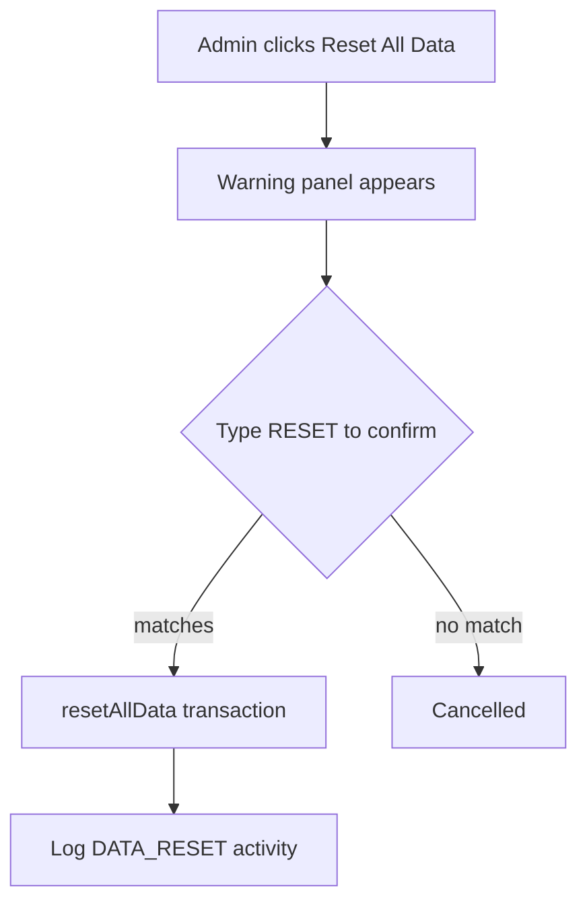

# Data Management

Admins can back up and reset all system data from the **Data Management** card on
the dashboard (`src/components/DataManagementCard.tsx`), backed by
`exportAllData()` and `resetAllData()` in `src/app/actions/admin.ts`.

## Exporting a backup (JSON)

Click **Export Backup (.json)** to download a full snapshot. The export runs in
the browser and produces a file named `qr-attendance-backup-YYYY-MM-DD.json`.

**What's included vs. excluded:**

| Included | Excluded |
|---|---|
| Admin, teacher, and student accounts (name, email, role) | **Passwords / hashes (never exported)** |
| Sections and subjects | |
| Student enrollments | |
| All attendance records and audit history | |
| All appeals | |
| System settings | |

The file is wrapped with `exportedAt`, a `version`, and a `data` object
containing each collection. Keep backups secure — they contain personal
information (names, emails, IDs).

## Resetting all data

**Reset All Data** wipes operational data for a fresh start (e.g. a new school
year) while keeping admins in place.



**Deleted:** all students, teachers (and their user accounts), sections,
subjects, enrollments, attendance, attendance audit, appeals, and activity logs.

**Preserved:** all **admin** accounts (including yours) and **system settings**.

The reset runs inside a single transaction and, once complete, records a
`DATA_RESET` entry in the activity log (written afterward so the admin account
still exists to attribute it to).

::: danger Irreversible
There is no undo. Always **export a backup first**, and consider a database-level
`pg_dump` snapshot (see [Database Setup](/getting-started/database#backups-and-recovery))
before resetting.
:::

## Re-seeding after a reset

To repopulate demo data after a reset, run the seed script:

```bash
pnpm db:seed
```

Re-seeding **upserts** demo records (1 admin, 1 teacher, 5 students, 3 subjects);
it does not wipe existing data.
