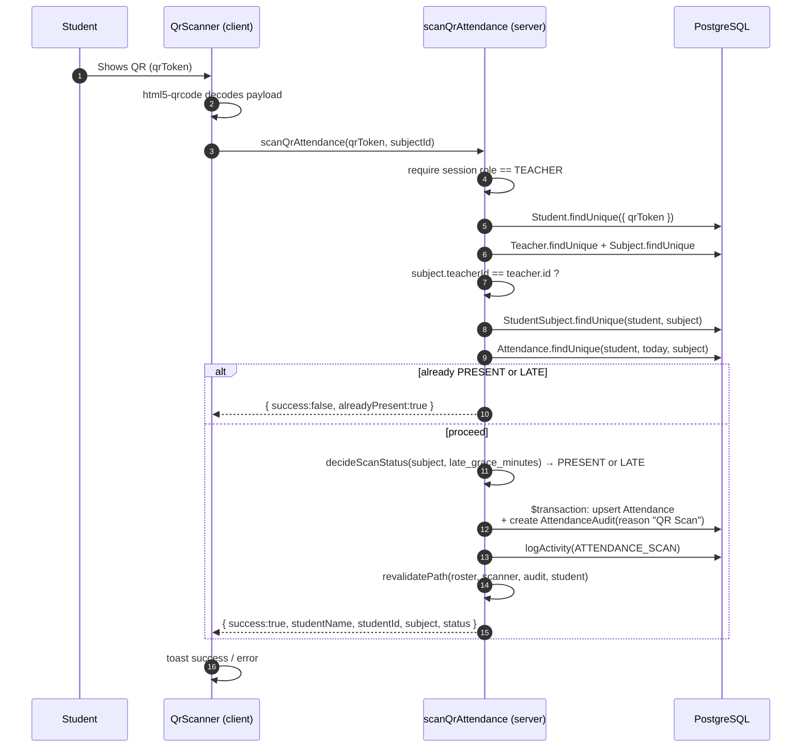

# QR Attendance Flow

This is the system's central feature: a teacher scans a student's QR code and the
student is marked present for the selected subject. The logic lives in
`scanQrAttendance()` in `src/app/actions/attendance.ts`, invoked from
`src/components/QrScanner.tsx`.

## End-to-end sequence

## Validation steps (in order)

`scanQrAttendance()` short-circuits with a specific message at each gate:

1. **Authorization** — throws unless the caller's role is `TEACHER`.
2. **Student lookup** — the `qrToken` must map to a real student, else
   *"Invalid QR code — student not found."*
3. **Subject & ownership** — the subject must exist and its `teacherId` must
   equal the scanning teacher's id, else *"You are not the teacher for …"*.
4. **Enrollment** — the student must have a `StudentSubject` row for that
   subject, else *"… is not enrolled in …"*.
5. **Duplicate guard** — if the student is already `PRESENT` or `LATE` today
   for that subject, the scan is skipped: *"… is already marked PRESENT/LATE
   today."*
6. **Lateness decision** — `decideScanStatus()` (`src/lib/schedule.ts`)
   compares the scan's Manila time to the subject's scheduled start time plus
   the `late_grace_minutes` system setting, yielding `PRESENT` or `LATE`.
7. **Commit** — inside a transaction, upsert the attendance to that status
   and create an `AttendanceAudit` row with `reason: "QR Scan"`.

## What gets written

- **`Attendance`** — upserted on the unique key `(studentId, date, subjectId)`
  where `date` is today's UTC midnight. Status becomes `PRESENT` or `LATE`.
- **`AttendanceAudit`** — a new immutable row recording `oldStatus`, `newStatus`,
  who changed it, and `reason = "QR Scan"`.
- **`ActivityLog`** — an `ATTENDANCE_SCAN` entry.

## Attendance statuses

| Status | How it's set |
|---|---|
| `PRESENT` | By a QR scan within the `late_grace_minutes` window, a manual toggle, or an approved appeal. |
| `LATE` | Automatically by a QR scan made after `late_grace_minutes` past the subject's scheduled start time, or by a manual toggle. |
| `ABSENT` | Automatically by the auto-absent cron sweep once class has ended with no scan, or by a manual toggle. |

## Auto LATE and auto ABSENT

Both "late" and "absent" are decided by the system, not left for a teacher to
toggle by hand:

- **LATE is decided at scan time**, as described above. E.g. a class starting
  8:00 AM with `late_grace_minutes` set to 30 marks any scan after 8:30 AM as
  `LATE` instead of `PRESENT`. Configure the grace period from Admin
  Dashboard → System Settings.
- **ABSENT is decided by a scheduled sweep**, since "no scan happened" can't
  be detected by a request handler. `runAutoAbsentSweep()`
  (`src/lib/autoAbsent.ts`) is invoked by the `/api/cron/mark-absent` route
  (registered in `vercel.json`, protected by `CRON_SECRET` the same way as
  the backup cron). On each run it finds subjects whose session has ended for
  today — using the schedule's explicit end time (e.g. the `09:30` in
  `08:00-09:30`), or `start + late_grace_minutes` when no end time is set —
  and creates an `ABSENT` `Attendance` row (with an `AttendanceAudit` row,
  `changedBy: "SYSTEM"`) for every enrolled student who still has no record
  for that subject/date. It never touches a row that already exists, so it's
  safe to run every few minutes and it never overwrites a scan, a manual
  edit, or an appeal. Turn the whole sweep off with the `auto_absent_enabled`
  system setting. The `*/10 * * * *` schedule in `vercel.json` needs a paid
  Vercel plan (the Hobby tier only runs crons once a day); on Hobby, either
  upgrade or trigger `GET /api/cron/mark-absent` (with the `CRON_SECRET`
  bearer token) from an external scheduler instead.
- **Appeals still work exactly the same way** against auto-marked records: a
  student can appeal an auto-`ABSENT` or auto-`LATE` day like any other, and
  an approved appeal upserts the `Attendance` row to `PRESENT`. See
  [Appeals](/features/appeals).

## Manual alternative

When scanning isn't possible, `updateAttendance()` handles manual roster toggles.
It applies the **time-lock** (teachers can't edit records older than
`attendance_lock_hours`; admins can) and writes the same audit trail. See the
[Teacher Guide](/user-guides/teacher#manual-roster).
