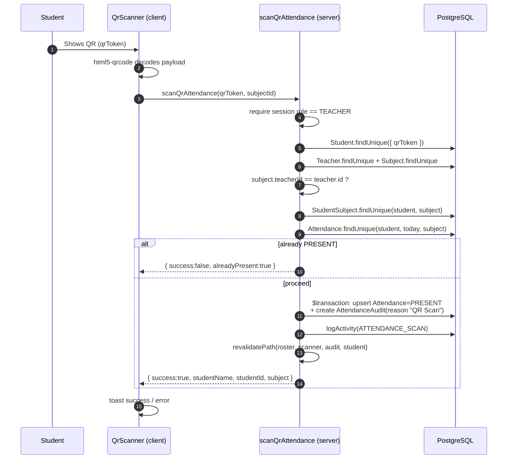

# QR Attendance Flow

This is the system's central feature: a teacher scans a student's QR code and the
student is marked present for the selected subject. The logic lives in
`scanQrAttendance()` in `src/app/actions/attendance.ts`, invoked from
`src/components/QrScanner.tsx`.

## End-to-end sequence

## Validation steps (in order)

`scanQrAttendance()` short-circuits with a specific message at each gate:

1. **Authorization** — throws unless the caller's role is `TEACHER`.
2. **Student lookup** — the `qrToken` must map to a real student, else
   *"Invalid QR code — student not found."*
3. **Subject & ownership** — the subject must exist and its `teacherId` must
   equal the scanning teacher's id, else *"You are not the teacher for …"*.
4. **Enrollment** — the student must have a `StudentSubject` row for that
   subject, else *"… is not enrolled in …"*.
5. **Duplicate guard** — if the student is already `PRESENT` today for that
   subject, the scan is skipped: *"… is already marked PRESENT today."*
6. **Commit** — otherwise, inside a transaction, upsert the attendance to
   `PRESENT` and create an `AttendanceAudit` row with `reason: "QR Scan"`.

## What gets written

- **`Attendance`** — upserted on the unique key `(studentId, date, subjectId)`
  where `date` is today's UTC midnight. Status becomes `PRESENT`.
- **`AttendanceAudit`** — a new immutable row recording `oldStatus`, `newStatus =
  PRESENT`, who changed it, and `reason = "QR Scan"`.
- **`ActivityLog`** — an `ATTENDANCE_SCAN` entry.

## Attendance statuses

| Status | How it's set |
|---|---|
| `PRESENT` | By a QR scan, a manual toggle, or an approved appeal. |
| `LATE` | By a manual roster toggle (teacher/admin). |
| `ABSENT` | By a manual toggle, or implied when no record exists. |

## Manual alternative

When scanning isn't possible, `updateAttendance()` handles manual roster toggles.
It applies the **time-lock** (teachers can't edit records older than
`attendance_lock_hours`; admins can) and writes the same audit trail. See the
[Teacher Guide](/user-guides/teacher#manual-roster).
