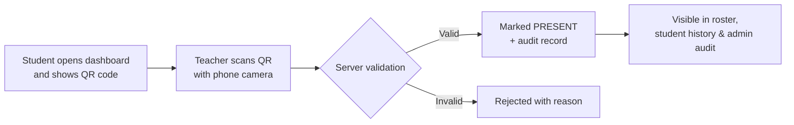

# System Overview

The **Secure QR Attendance System** is a web-based platform that streamlines
attendance monitoring in schools. It is built around a single operational idea:

> **Teacher-as-Scanner** — the teacher uses their own phone camera to scan each
> student's QR code, and attendance is recorded instantly and verifiably.

When scanning is not practical, two fallbacks keep records accurate: teachers can
toggle attendance manually on a roster, and students can file evidence-based
**appeals** that staff review.

## Actors

The system recognises three roles (`UserRole` enum: `ADMIN`, `TEACHER`,
`STUDENT`). After login, each user is routed to their own portal and cannot
access another role's routes.

| Role | Lands on | Primary responsibilities |
|---|---|---|
| **Admin** | `/admin/dashboard` | Manage the masterlist (sections, subjects, students), manage staff, configure settings, review audit logs, import CSV data, export backups, and reset data. |
| **Teacher** | `/teacher/roster` | Scan student QR codes for subjects they teach, adjust attendance on their roster, and review appeals from their students. |
| **Student** | `/student/dashboard` | Display their personal QR code, review attendance history, submit appeals, and change their password. |

## The core flow at a glance

The scan is only accepted after the server confirms a chain of conditions — the
QR token maps to a real student, the teacher owns the scanned subject, and the
student is enrolled in it. See the [QR Attendance Flow](/features/qr-attendance)
for the full sequence.

## What makes it "secure"?

The name reflects a set of server-enforced guarantees rather than a single
feature:

- **Role-based access control** in middleware and in every server action.
- **Server-side scan validation** — the QR code alone is not enough; the server
  re-checks student, subject ownership, and enrollment on every scan.
- **Immutable auditing** — every attendance change writes an `AttendanceAudit`
  row, and every mutation writes an `ActivityLog` entry.
- **Time-locking** — teachers cannot edit attendance older than a configurable
  window; only admins can.
- **Hashed credentials** — all passwords are stored as bcrypt hashes.

::: warning An honest note for your thesis
The QR code encodes a **static, unsigned UUID**, not a cryptographically signed
or time-limited token. Security comes from *server-side validation* and
*admin-triggered token regeneration*, not from the QR payload itself. This is
discussed candidly in [QR Token Design](/security/qr-tokens) and
[Limitations](/thesis/limitations).
:::

## Where to go next

- [Problem & Objectives](/guide/objectives) — the academic framing.
- [Key Features](/guide/features) — a module-by-module feature list.
- [Getting Started](/getting-started/installation) — run it locally.
- [Architecture Overview](/architecture/overview) — how the pieces fit together.
