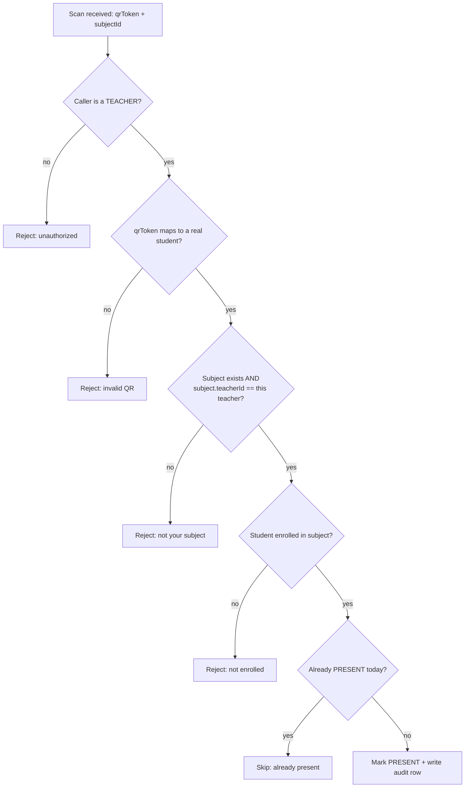

# QR Token Design

This page explains, candidly, how the "secure" QR mechanism actually works. It is
important for the thesis to describe this accurately rather than overstate it.

## What the QR code contains

Each student has a `qrToken` field — a random **UUID** generated with
`crypto.randomUUID()` and stored on the `Student` record. The student's QR code
is simply this UUID rendered as a QR image (`qrcode.react`, error-correction
level "H"). It is:

- **Opaque** — a random identifier that reveals nothing about the student.
- **Unique** — enforced by a unique constraint in the database.
- **Static** — it does **not** change over time and is **not** cryptographically
  signed or time-limited.

::: warning Be precise in your writeup
The QR payload is *not* a signed JWT and *not* an expiring one-time code. If
someone copies the image, the copy scans identically until the token is
regenerated. Security therefore comes from **server-side validation** and
**revocation**, not from the token format.
:::

## Where the security actually comes from

A scanned token is only accepted after the server (`scanQrAttendance` in
`src/app/actions/attendance.ts`) confirms a chain of conditions:

Because these checks run **on the server** on every scan, a stolen or fabricated
code cannot mark attendance unless it also corresponds to a real, enrolled
student being scanned by the correct subject teacher.

## Revocation

If a code is lost or copied, an admin can **regenerate** the student's token
(`regenerateQrToken`). This assigns a brand-new UUID, instantly invalidating the
old QR image. This is the system's revocation mechanism, and it is recorded in
the activity log (`STUDENT_QR_REGEN`).

## Threats this design does and doesn't address

| Threat | Addressed? | How / why |
|---|---|---|
| Random guessing of a token | ✅ | UUIDs are 122-bit random; brute force is infeasible. |
| Marking a non-enrolled student | ✅ | Enrollment is re-checked server-side. |
| A teacher scanning for a subject they don't teach | ✅ | Subject ownership is verified. |
| A student marking themselves | ✅ | Only teachers can scan; students can't call the scan action. |
| Duplicate/replayed scans | ✅ (partial) | Already-PRESENT students are skipped for the day. |
| **Copying/screenshotting a valid QR** | ⚠️ Partial | The copy works until the token is regenerated; the system relies on the teacher physically scanning the right person. |
| **Signed/expiring tokens** | ❌ | Not implemented — a candidate for future work. |

See [Limitations & Future Work](/thesis/limitations) for how this could be
hardened (signed, rotating, or time-boxed tokens).
