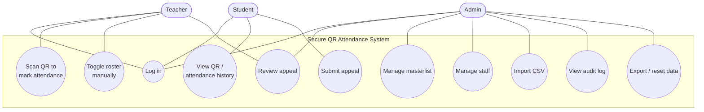
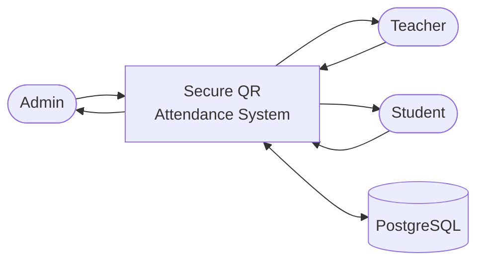
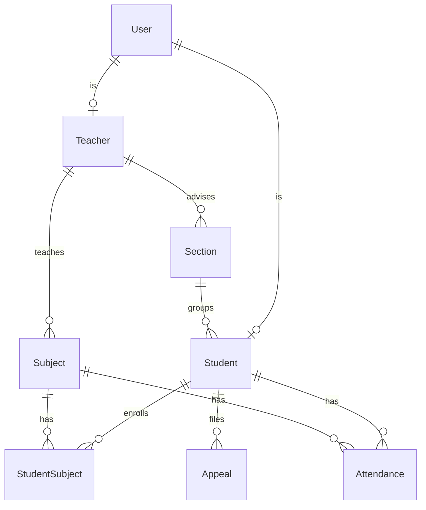
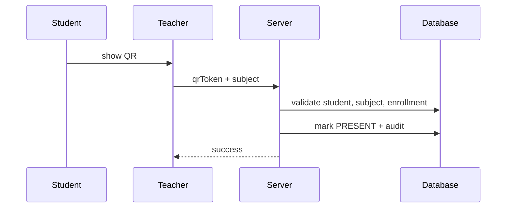
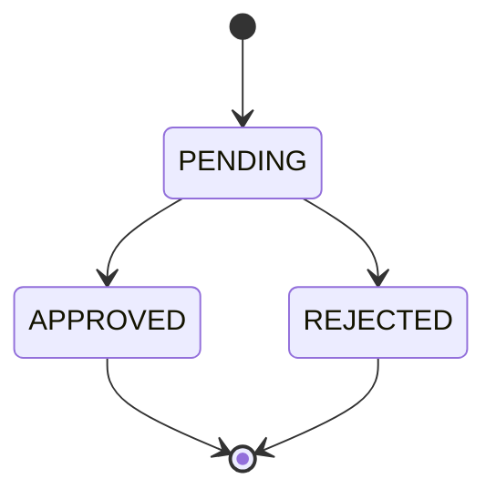
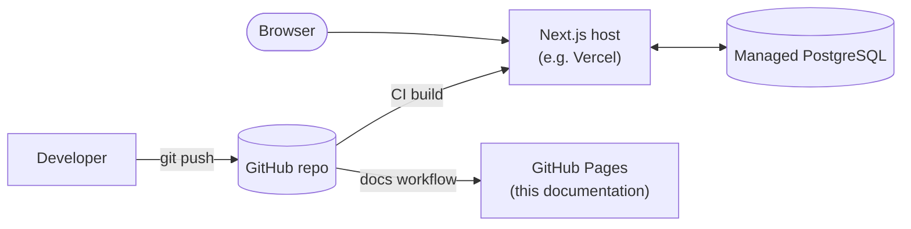

# System Diagrams

A consolidated set of diagrams for the thesis appendix. Each is also discussed in
context elsewhere in this site (linked below).

## Use-case diagram

## Context diagram (DFD Level 0)

See [Data Flow](/architecture/data-flow#context-diagram-level-0).

## Entity–relationship diagram

The full ERD with attributes is on the [ER Diagram](/database/er-diagram) page.
Simplified view:

## Sequence: QR scan

The detailed version with validation gates is on the
[QR Attendance Flow](/features/qr-attendance) page.

## Activity: appeal review

## Deployment view

