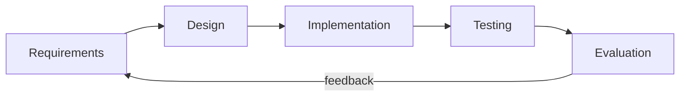

# Methodology

This section frames the development approach for the thesis document. Adapt the
wording to your school's required format.

## Development model

The system was developed using an **iterative, incremental** approach (Agile-
flavoured). Rather than building everything before testing, the team delivered
the system in working slices — authentication first, then attendance capture,
then administration and reporting — validating each with realistic data (the seed
dataset and CSV imports) before moving on.

## Phases

### 1. Requirements analysis
Identified the actors (admin, teacher, student) and the core need: fast,
verifiable, auditable attendance on hardware teachers already own. Produced the
objectives in [Problem & Objectives](/guide/objectives).

### 2. System design
- **Data model** — entities and relationships (see the
  [ER Diagram](/database/er-diagram)).
- **Architecture** — a monolithic full-stack Next.js app with Server Actions and
  role-based middleware (see [Architecture](/architecture/overview)).
- **Process design** — the QR scan flow and appeals workflow
  ([Data Flow](/architecture/data-flow)).

### 3. Implementation
Built with Next.js 16 (App Router), TypeScript, Prisma/PostgreSQL, and NextAuth.
Mutations were implemented as authorised Server Actions with consistent auditing
and revalidation ([Conventions](/developer/conventions)).

### 4. Testing
Functional and integration checks across the three roles, plus verification of
the security controls (authorization, time-lock, scan validation). See
[Testing & QA](/thesis/testing).

### 5. Evaluation
Assessed against the specific objectives — did scanning work reliably, were
records correctly scoped and audited, and could admins manage data at scale via
CSV import?

## Tools & techniques

| Area | Choice |
|---|---|
| Version control | Git / GitHub |
| Framework & language | Next.js 16, TypeScript |
| Database & ORM | PostgreSQL, Prisma |
| Auth | NextAuth v4 (Credentials + JWT) |
| Diagramming | Mermaid (rendered in this documentation) |
| Documentation | VitePress (this site) |

## Requirements summary

| Type | Requirements (abridged) |
|---|---|
| **Functional** | Login by role; display/scan QR; mark PRESENT/ABSENT/LATE; manual roster; appeals; masterlist CRUD; CSV import; audit log; export & reset. |
| **Non-functional** | Mobile-friendly; server-side authorization; auditable; timezone-consistent; hashed credentials; usable without special hardware. |
